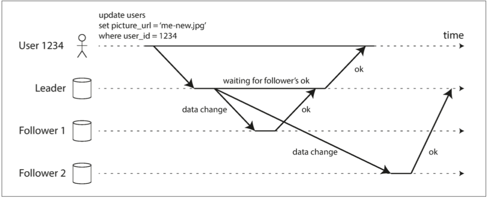

#数据密集型应用笔记

## 1.可靠性，可伸缩性和可维护性
- 可靠性面临的问题：硬件故障，软件故障，人为错误
- 可伸缩性包括：描述负载，描述性能（吞吐和响应时间，其中响应时间又需要去关注中位数和尾部延迟来描述）
- 可维护性：可操作性，简单性，可演化性
- 可操作性：人生苦短，关爱运维
- 简单性：管理复杂度
- 可演化性：拥抱变化

## 2.数据模型与查询语言
- NoSQL：Not only SQL
- 关系模型和网络模型还有文档数据库
- JSON文档拥有更好的局部性所以可以和代码相匹配 
### 用那种数据库？
如果有类似文档的结构，一对多或者一次性家在整个树，可以使用文档模型。
如果有多对多关系，就需要用反规范化来消除对连接的需求。

## 3.存储与检索
- LSM树有点类似与B树，LSM树的写入速度更快，但是B树的读取速度更快
- 对比LSM树和B树的优缺点

## 4.数据编码
## 5，分布式数据- 复制
- 伸缩载荷氛围水平和垂直
- 三种复制变更算法：单领导，多领导，无领导
- 热备：可以接受客户端读请求的副本，温备：只追随领导者不接受客户端的任何查询
- 同步和异步

- 故障切换：脑裂，爆彼之头
复制日志的实现：
- 基于语句的复制（问题在于，有一些非确定性函数和自增列的不同，所以不是特别好）
- 逻辑日志复制：MySQL的方式binLog
- 基于触发器的复制，这种虽然比较灵活，但是有更高的开销和容易出错    
- 写后读的一致性，以及可能碰到的时光倒流问题
- 一致前缀读
- 多主复制的应用场景
- 无主复制的场景
## 6.分区
- 数据偏斜和热点
- 散列分区的一个问题是失去了键和键之间的关联，无法高效执行范围查询的能力
- 哈希分区可以帮助减少热点，但是无法完全避免。因为可能出现都是对一个主键的读写，解决办法是对主键进行分割，对主键添加随机数，存储在不同的分区中。
- 对关键词的次级索引进行分区
- 再平衡策略：hash mod N是不合适的，因为每次伸缩都会移动不需要的数据。 固定数量分区，用移动分区的方式分配给新节点。  动态分区
- gateway 的策略层来找到对应节点

## 7.事务
- 事务是用来简化问题的首选机制
- ACID原则，不符合它的可以变成BASE模型 Basically Available/Soft stae/Eventually consistency
- 隔离级别中默认读已提交：没有脏写脏读，可重复读：用快照读来实现
- 丢失更新，在这一点MYSQL并不完全符合快照隔离的定义，有时候会丢失更新
- CAS是一个有效的设置，写时锁定
- 写入偏差导致的幻读，快照隔离解决了在只读过程中幻读，但是没有解决写入过程中的幻读
- 串行执行需要满足几个条件，否则会成为很大的开销，比如在内存中解决一切。
- 二阶段锁：共享锁和独占锁，在MYSQL串行模式有使用到，读时共享锁，写时独占。缺点是容易产生死锁，数据会检测并中断，由应用程序重试。
- 谓词锁：符合条件的不存在的也上锁。
- 索引范围锁，锁定插入范围

## 8.分布式系统
- 有序时间戳：LWW 最后写入胜利
- 真想由多数定义：在分布式系统中总是少数服从多数
- 半断开：一个节点能听到其他节点的讯息，但是不能自己发出，就会被定义成死亡
- 防护令牌来保证只有一个节点
- 拜占庭故障：假设每个节点都有可能错误和故障

## 9.一致性问题
- 线性一致性是最强的一致性，对外而言仿佛只有一个副本
- 单主算法不一定线性一致，共识算法保证了线性一致性，多主算法-非线性一致
- 线性一致性必须和可用性（网络分区）做一个tradeoff
- 兰伯特时间戳
- 全序广播：复制时经常用到的
- 2PC的主要问题是协调者的负担，会造成阻塞，而3PC可以解决但是无法保证原子性。

## 10.批处理/流处理
- 大体上分为三种系统：服务（在线系统），批处理（离线系统），流处理系统（准实时系统）
- 
   
- 