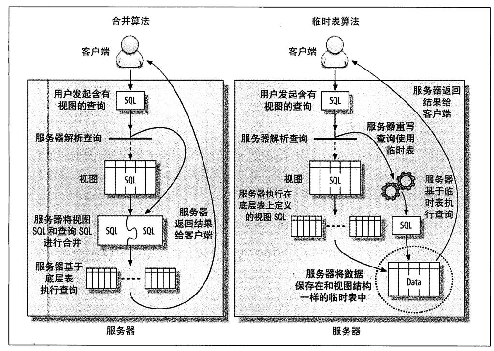
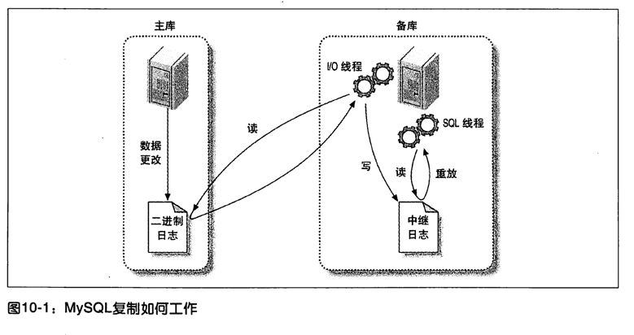

# 高性能Mysql笔记
阅读《高性能MySQL》笔记

## MySQL架构

- 每个客户端连接都对应一个线程，线程的管理由主服务器完成
- 优化器用来解释查询，可以用explain来查看要素
- 事务的ACID特性/四个隔离级别
- InnoDB会检索死锁的循环依赖，返回一个错误。将持有最少行级排他锁的事务回滚
- MVCC是行级锁的变种，避免加锁操作。用快照来实现不加锁的读。

## MySQL基准测试和性能剖析
- 主要测试指标 latency/throughout/并发性
- 用慢查询日志来排查。SHOW PROFILES 可以显示查询记录的时间
- 剖析工具好复杂，看不懂

## 数据类型优化
- 原则：可以正确存储的最小数据类型/简单就好/避免null
- NULL的存在会让索引和存储更加复杂，最好使用NOT NULL
### 小数
- DECIMAL支持准确计算，不会出现FLOAT类型的取舍，而且可以用来存储比BIGINT还大的整数
- DECIMAL一般用在财务计算，还有一种神奇的方式是把小数放大用BIGINT来存
- MySQL默认用DOUBLE作为浮点计算的类型
### 字符串
- VARCHAR的空间可变，CHAR是固定。但是需要看MySQL的行是不是也是可变的。
- VARCHAR由长度和数据组成 。节省了空间，但是因为可以变长，update的时候会更麻烦。但是最好不要随便分配，也会造成性能损失。
- BLOB和TEXT用来专门处理长字符串，二进制存储。（效率比较差，尽可能不用）
- 枚举效率差，不用这个类型
### 时间和日期
- MySQL的时间粒度为秒
- DATETIME保存大范围的值，精度为秒。被封装成了YYYYMMDDHHMMSS的整数，时区无关，可排序
- TIMESTAMP是1970年以来的秒数。和时区有关。如果没有指定，就用系统时间来设置。
- 如果要存微秒以下的，可以自定义一个列，用double来存小数。
### 其他数据
- 提供了位数据存储
- IP地址可以转成整数再存储，MySQL提供了函数来操作

### SCHEMA设计要点
1. 列不要太多
2. 不要设置太多关联
3. 不要用太多枚举和SET
4. 避免NULL，可以用-1之类的。

### 使用范式
- 范式化的表格更新更快，操作更快
- 有第一第二第三第四范式等，参考[这个](https://baike.baidu.com/item/%E6%95%B0%E6%8D%AE%E5%BA%93%E8%8C%83%E5%BC%8F/7309898)
- 反范式可以不用关联，可以避免随机IO
- 统计表和汇总表的使用更加高效
- 计数器表格的设计可以加入很多槽，再统一汇总来避免并行的锁
### 这章的总结

## 高性能索引
- B-Tree索引和哈希索引，比较常见
- 空间数据索引 R-Tree 和全文索引
- 前缀长度保证前缀是唯一的
- 索引合并，联合索引
- 不用UUID，最好按顺序插入行，保证主键的递增
- order by要求和索引顺序和排序方向一致才能用索引
- 前缀压缩
- 冗余和重复索引会影响性能，冗余表示不需要的，MySQL可以创建重复索引
- 索引可以减少锁定的行，不走索引的话会发生全表扫描，并且用表锁。
- 在主键索引用排他锁，在二级索引用共享锁   
 

### trick
1. 可以用and in 来绕过某些前缀索引
2. 尽可能把需要范围查询的列放在后面
3. 避免多个范围条件（解决办法就是设置多个等值查询）
4. 对于大页数的排序，可以用延迟关联的方式避免扫描需要丢弃的行数
### 总结原则

## 查询性能优化
### 主要要点
1. 是否向数据库请求了不需要的数据
2. 是否在扫描额外的记录
看一看扫描了多少行，以及访问类型。用EXPLAIN语句的type列来看访问类型。    
速度：全表扫描<索引扫描<范围扫描<唯一索引查询<常数引用

where在索引上可以用引擎优化，如果不在就是using where来主动剔除不满足需要的
- MySQL的设计让连接和断开都很轻量级，所以小查询有时候比复合查询更快速
- 分解关联查询
- MySQL是一个半双工的通信，无法中途断开接受，所以记得限制limit
- 关联是一个比较复杂的过程，通过潜逃循环的方式来实现
- 小范围排序在内存里进行，大范围的在磁盘里排序
- MySQL无法利用多核特性进行并行查询
- EXPLAIN可以提供一个近似值
- 关联查询的那一部分没有完全看懂
- group by 无法使用索引的时候，用临时表或者文件排序来做分组
- 延迟关联就是，只扫描覆盖索引，然后用覆盖索引去和原表做关联，减少要扫描的列
- 用书签的方法降低扫描开销
- 重复查询刚更新的数据可以用一个变量来记录
- 也可以用一个变量来统计修改的行数
- 区分冷热数据，用一个条件的偷懒查询来提高命中率
- 减少使用select for update
### 总结

## 高级特性
- 分区表用 PARTITION BY 来定义
- 冷热分区是很常见的思路
- 分区表达式的值不能为NULL
- 不同分区的有独立的索引，如果不包含分区条件，就要对每一个索引进行搜索，会降低速度。
- 分区数目是100个左右差不多，如果太多会提高选择分区的成本

### 视图
- 视图是一个临时的虚拟表格，不存放数据，返回的数据来自于其他的表格。
- 合并算法和临时表算法，合并算法会是比较多用。一个基于底层表格，一个有临时的备份

- 可修改的视图
- 视图可以用来基于列的权限控制，却不需要在系统中创建列权限，没有额外的开销。
- 但是临时表因为不能建立索引，所以会造成很大的开销
### 其他东西
- 触发器不能保证更新的原子性，但是可以降低网络开销，掩盖服务器的工作。
- 支持定时事件
- 绑定变量可以降低传输语句的时间，优化器的时间和解码时间，只需要传输一次语句和多次变量。不容易被SQL注入和攻击。
- 绑定变量是会话级别，不能公用句柄

### 分布式事务
- 内部XA事务不太行
- 外部也不太行？
- 缓存查询在一些情况下更快，但是很多时候会影响服务器的扩展性

## 优化服务器设置
1. 设置数据的位置
2. 指定mysqld进程的运行用户
3. 引擎用InnoDB就行
4. 默认值的缓冲池和日志文件太小，缓冲池的大小设置成内存的75%
5. 打开文件的句柄数目调大
6. InnoDB严重依赖缓冲池，必须预留足够的内存

- 线程缓存可以加快对每个连接线程的响应
- 表缓存是比较落后的设计，和线程缓存一样是节约打开表的开销。但是让引擎和服务器设计不够分离的结果，InnoDB里几本不用它，使用自己的数据字典
数据字典不存在缓存过期的策略，所以可能出现内存泄漏。InnoDB没有做持久化，所以要花很久时间才能完全预热。
- InnoDB用日志把随机I/O变成顺序IO。日志写到磁盘，事务就被持久化了。即便变更没有写到数据文件，也可以用日志恢复。
- 日志是环形方式书写的，但不会覆盖没有写到数据的日志。
- 变更数据先写到日志缓冲区，每一秒钟，缓冲区满，事务提交这三个条件任意一个会让日志缓冲区写到磁盘里。
- 日志缓冲区一般1-8MB，设置得大一些也可帮助避免压力瓶颈。所以设置32MB-128MB，日志文件的全部大小应该容纳服务器一个小时的活动内容。
- 并发值 = CPU * 磁盘 * 2
- 因为如果太多线程进入内核的话，会有一个切换线程的开销

## 优化系统和硬件
- 单核性能高一些其实更好
- 顺序IO比随机IO速度快，但是不能用到缓存
- 一次写入减少IO瓶颈，多次写入，一次刷新。写入因为缓冲收益，把随机IO转换到连续IO
- 评估缓存命中率可以用CPU的使用率
- 二进制日志和数据文件分离分盘，减少同时丢失数据和日志的可能性
- 尽可能不用虚拟内存

## 复制
- 向下兼容
- 对主库主要是IO和网络开销
- 适合少写多读的场合

- IO线程不进行轮询，等主库发送信号通知即可
- 不支持多主库复制
- 环形复制比较脆弱，其实用多主动，轮流复制，每个主库再带从库的方式已经非常奏效了
- 分发主库

## 可扩展性
1. 功能拆分
2. 数据分片（尽可能推迟分片
3. 分片和节点不是一对一，最好一个节点可以存储多个分片
4. 固定分片无法自定义数据的位置，而且很难平衡不同分片的负载。动态分片根据分区键来获取分片号，需要一个分区函数，容易做控制
5. 保持活跃数据的独立
6. 负载均衡的可扩展性，高效性，可用性,透明性，一致性。

读写分离方式：
查询分离，脏数据分离，__会话分离__ __版本分离__    
修改DNS名是比较低级的负载均衡方式
转移IP地址也是比较简单
常见中间件负载均衡的算法： 随机，轮询，最少连接数，最快响应，哈希，权重

## 高可用性
高可用性的思路
1. 提升平均失效时间
2. 降低平均恢复时间
3. 避免单点失效
4. 共享存储或磁盘复制
5. 故障转移包括IP地址转移

## 云端的MySQL
1. AWS云服务提供了更好的可扩展性和易维护性，更低的成本
2. RDS DBaaS

## 应用层优化
1. 寻找最优并法度

## 备份与恢复
两种一致性，数据一致性和文件一致性

