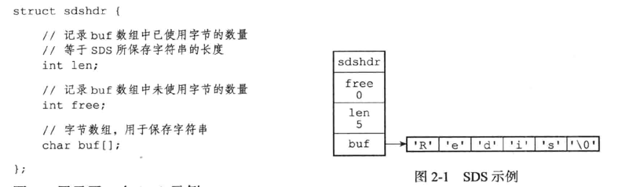
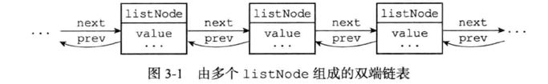
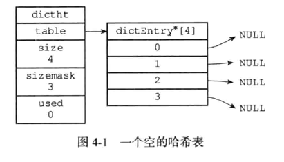
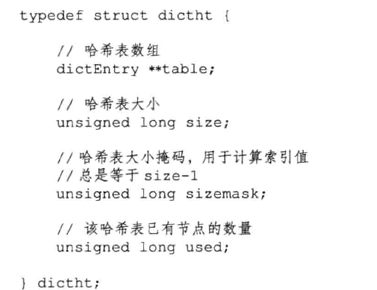

# Redis设计与实现
## 1. 引言和简单动态字符串
- 数据库是由对象组成，其中键都是字符串对象，值则是有五种对象。   
- SDS（Simple Dynamic String)是默认字符串表示，键和部分值都是由SDS储存。还作为缓冲区如AOF。

优点：
1. 查询长度O(1)
2. 防止内存溢出
3. 减少修改字符串时带来的内存重分配次数。（因为数据库高修改）主要因为预分配空间和惰性空间释放
4. 对内容二进制化，不需要任何编码
5. 兼容了部分C语言函数

## 2. 链表

特性：双端，无环，带头尾指针，带长度计数，多态

## 3. 字典
- 字典的底层实现是哈希表

- 哈希算法用的是MurmurHash2
- 链地址法解决冲突（头插法O(1))
- rehash容量*2/2，条件是负载因子大于等于1或者大于等于5（状态不同）
- 渐进式的rehash提高响应，rehashidx表示从0开始一个一个搬迁，-1表示结束。同时拥有两个表，所以要查找两次

## 4，跳跃表
- 跳跃表平均查找O(log n)，最差O(n)的效率，并且比平衡树简单。
- 只有两个地方用到，实现有序集合见和集群节点
- 后退指针用于从尾遍历
- 前进指针是一个数组，带有跨度和指向

## 5. 整数集合
- 就是一个可以自适应整数数组，可以升级，节约内存

## 6. 压缩列表
- 用于节约内存的列表键和哈希键的实现
- 三个部分，前面一个的长度，encoding，content
- 连锁更新 最差On2，

## 7. 对象
- 字符串编码包括int，long，还有一个特别的embstr用于保存短字符串
- 列表对象的编码包括压缩链表和链表
- 哈希对象的编码是压缩链表或者哈希表
- 集合对象是整数集合或者哈希表
- 有序集合编码为压缩链表或者跳表，zset结构同时包含一个字典和一个跳跃表
- 引用计数进行内存回收，并且进行对象共享

这一节也没有完全看懂，回去还要再看

## 8. 数据库
- 三种过期删除策略。定时删除，惰性删除，定期删除，redis使用了后两种
- RDB不会载入过期键
- AOF会显式地加入一条del命令表示删除

## 9. 持久化
- BGSAVE比SAVE好在不阻塞
- AOF更新频率比RDB更新高
- （Expiretime ms）type key value
- AOF重写来缩小aof的文件大小

## 10.事件
- 使用I/O多路复用监听多个套接字
- ***没有完全看懂***

## 11.客户端
- 客户端的关闭可以有多种原因，很多原因来源于客户端的错误命令

## 12.实战
- 一个热度的trick，用创建事件+票数*权重
- 令牌cookie和签名cookie
