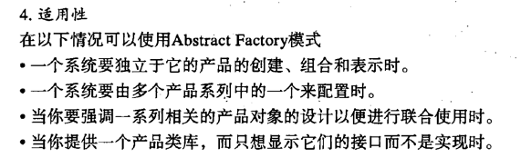
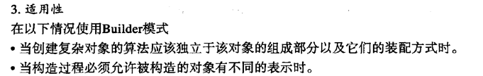
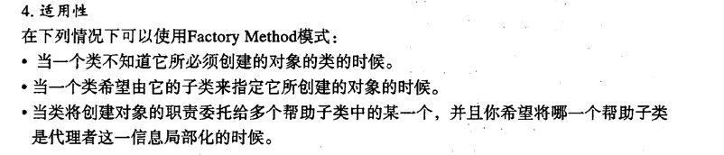
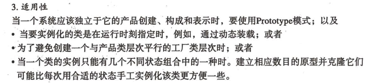
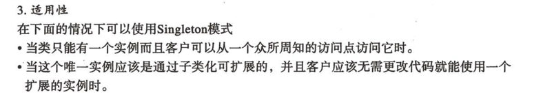
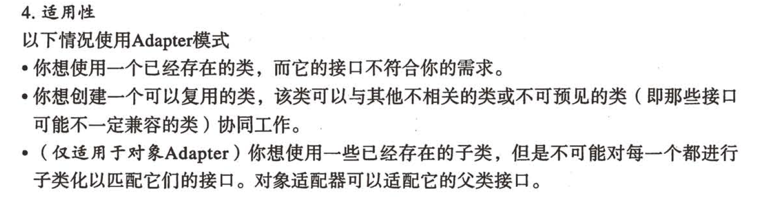
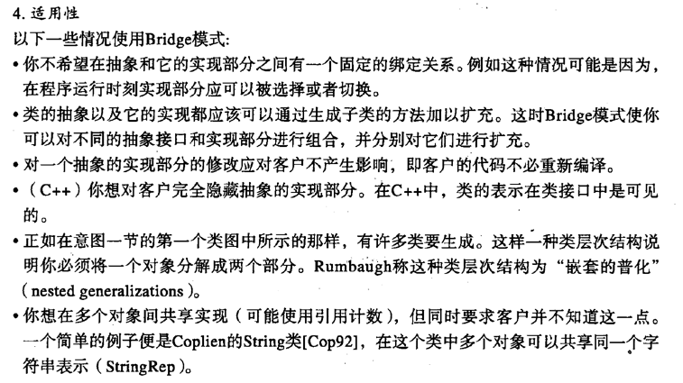
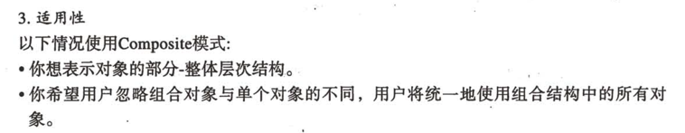
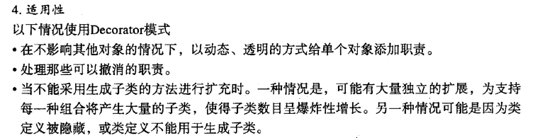

# 设计模式
## 1 导言
- 类继承和接口继承的区别： 类定义了对象怎样实现，而接口知识定义了表达
- 针对接口编程，不针对实现编程
- 优先使用对象的组合而不是类继承
- 相识和聚合的关系，比较容易的区别是生命周期，需不需要为另一个负责

# 2 创建型模式
## 抽象工厂模式

- 工厂通常是单例的，并且可以用通常工厂模式实现。

## 生成器模式
- 把一个复杂对象的生成他的表示分离，以此实现复用，用于不同过程

- 构造代码和对象本身分离，并且可以精细化地控制构造过程
- 和工厂模式的不同在于，抽象工厂模式是生成多个系列的产品，而生成器侧重于一步步构造出一个复杂的对象，最后返回

## 工厂方法

- 抽象工厂通常是用工厂模式来实现的

## 原型
- 用原型实例来制定创建对象的种类，通过拷贝来生成新的对象

## 单例
- 只需要一个对象，为了防止重复创建的时候
- 
- 为了线程安全也也要在构造例防止被重复创建

# 3 结构型模式
## 适配器模式 Adapter
- 把两个不同的接口通过一个适配器（中介）进行配合使用

- bridge 模式是把结构和实现进行分离，而adapter模式是用来改变接口
- decorator模式是不修改他的接口前提下，进行更复杂的操作。

## 桥接模式 Bridge
- 把抽象部分和他的实体部分进行分离，使他们可以独立的变化
- 
- HashSet 可以是对set的一种实现，是一种退化的桥接模式

## Composite 组合模式
- 是对象的组合形成一个树状的结构，以表示 部分-整体的结构
- 
- 需要考虑组件的合适数据结构

## Decorator 装饰模式
- 给一个对象添加额外的职责，比生成子类更加灵活
- 
- 比静态继承更加灵活，添加和分离的方式在运行的时候增加动态的职责
- 一层一层的引用和包装来实现装饰，需要好好体会源码

## Facade 外观模式
- 为子系统的一组接口提供一个统一的页面，用facade定义高级的接口