# 设计模式
## 1 导言
- 类继承和接口继承的区别： 类定义了对象怎样实现，而接口知识定义了表达
- 针对接口编程，不针对实现编程
- 优先使用对象的组合而不是类继承
- 相识和聚合的关系，比较容易的区别是生命周期，需不需要为另一个负责

# 2 创建型模式
## 抽象工厂模式

- 工厂通常是单例的，并且可以用通常工厂模式实现。

## 生成器模式
- 把一个复杂对象的生成他的表示分离，以此实现复用，用于不同过程

- 构造代码和对象本身分离，并且可以精细化地控制构造过程
- 和工厂模式的不同在于，抽象工厂模式是生成多个系列的产品，而生成器侧重于一步步构造出一个复杂的对象，最后返回

## 工厂方法

- 抽象工厂通常是用工厂模式来实现的

## 原型
- 用原型实例来制定创建对象的种类，通过拷贝来生成新的对象

## 单例
- 只需要一个对象，为了防止重复创建的时候
- 
- 为了线程安全也也要在构造例防止被重复创建

# 3 结构型模式
## 适配器模式 Adapter
- 把两个不同的接口通过一个适配器（中介）进行配合使用

- bridge 模式是把结构和实现进行分离，而adapter模式是用来改变接口
- decorator模式是不修改他的接口前提下，进行更复杂的操作。

## 桥接模式 Bridge
- 把抽象部分和他的实体部分进行分离，使他们可以独立的变化
- 
- HashSet 可以是对set的一种实现，是一种退化的桥接模式

## Composite 组合模式
- 是对象的组合形成一个树状的结构，以表示 部分-整体的结构
- 
- 需要考虑组件的合适数据结构

## Decorator 装饰模式
- 给一个对象添加额外的职责，比生成子类更加灵活
- 
- 比静态继承更加灵活，添加和分离的方式在运行的时候增加动态的职责
- 一层一层的引用和包装来实现装饰，需要好好体会源码

## Facade 外观模式
- 为子系统的一组接口提供一个统一的页面，用facade定义高级的接口
- 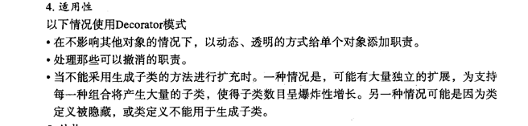
- 其实只是在对外部隐藏细节，用一个统一的外观来实现抽象
- ***为什么是用单例来实现呢***

## Flyweight 享元模式
- 运用共享技术有效地支持大量细颗粒度地对象
- 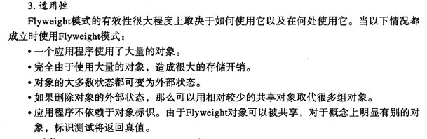
- 大致意思是在对象大量复用的时候，用一个共享单元和外部的状态共同表示一个特定的对象
- 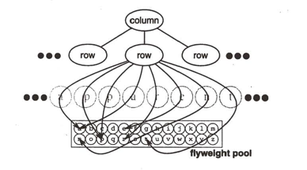

## Proxy 代理
- 为其他对象提供一种代理以控制对这个对象的访问
- 可以节约内存，以及可以隐藏一种写时复制的优化技术，降低复制庞大对象的开销。
- 可以分为动态和静态的，其实动态用的更多一些
- 
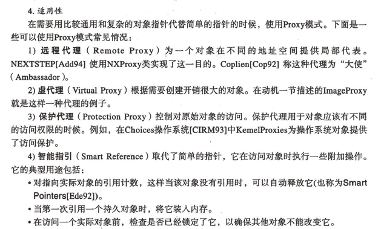

## 结构型
- Adapter和bridge出现在软件设计的不同阶段，也可以用facade来定义新的接口
- composite是用树状的方式实现的，而decorator则是采用一种链状的方式，无需生成子类。在proxy中只是提供一个访问，不提供额外的功能和行为

# 对象行为模式
## 职责链
- 让多个对象都有机会处理请求，从而避免发送者和接受者之间的耦合关系。把这些对象连成一条链，并且沿着这条链传递请求，直到有一个对象处理为止。
- 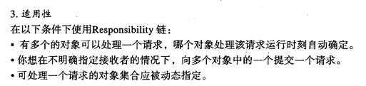
- 相对自由，但是不保证请求会被处理，如果需要具体的后续者，则要在类中进行定义。
- 职责链经常和composite一起用，

## command 命令模式
- 把请求封装成一个对象，就可以用不同的客户端进行参数化，对请求排队或者记录请求

## interpreter 解释器模式
- 给定一个语言，定义它的文法的一个表示，并且定义一个解释器，用这个解释器使用并解释其中的句子
- 享元模式flyweight可以帮助进行文法表示

## iterator 迭代器模式
- 提供一种顺序访问元素的接口，但是又不暴露内部的对象表示
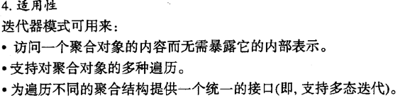

## mediator 中介对象
- 用一个疏散的中介对象来封装一系列的对象交互，中介者的存在让对象互相显式地引用，使其耦合疏散。
- 因为中介者类的存在，只要对中介者进行继承或者替换就可以实现不同对象之间的多态互动
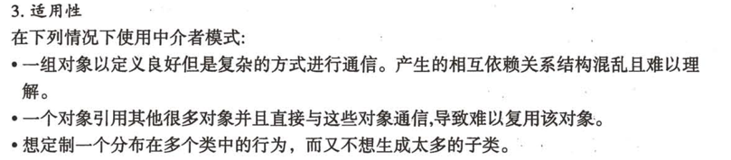

## memo 备忘录模式
- 在不破坏封装性的前提下，捕捉一个对象的内部状态，进行保存，就可以在未来恢复这个对象的状态
- 用一个获取备忘录接口来备份
- 因为保存的开销比较大，所以最好支持增量保存

## observer 观察者模式
- 定义一种对象见的一对多依赖模式，当一个对象的状态发生更替时，通知所有它的依赖对象
- 一种订阅-发布模式
- 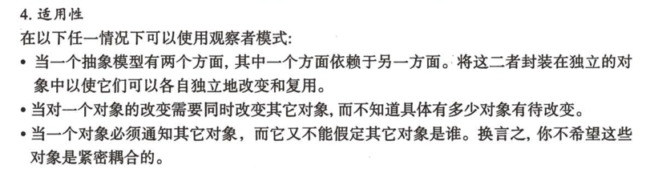
- 经典mvc模式

## State 状态模式
- 允许一个对象在起内部对象状态改变的时候改变它的行为，使其看起来修改了对象
- 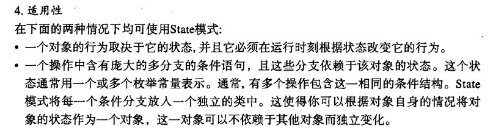
- 经典TCP连接，根据TCP的状态来修改，把超类的所有行为委托给状态来实现

## strategy 策略模式
- 定义一系列的算法，把他们一个个封装起来，并且使他们可相互替换。本模式可以让算法独立于类进行修改
- 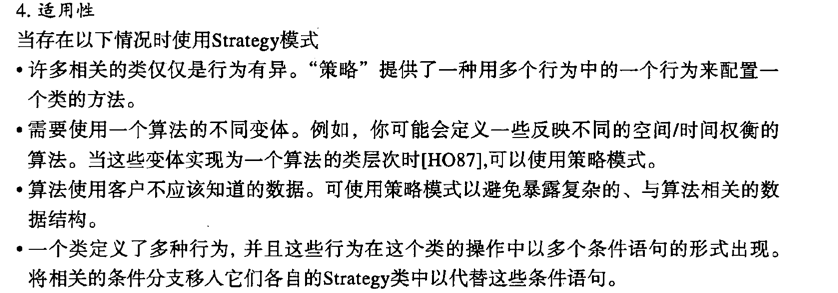
- 缺点就是客户要自己知道潜在的算法

## template 模板模式
- 定义一个操作中的算法骨架，但是其中的一些具体行为延迟到子类中。template方式可以使子类不改变一个算法的结构就可以重新定义其中的特定步骤
- 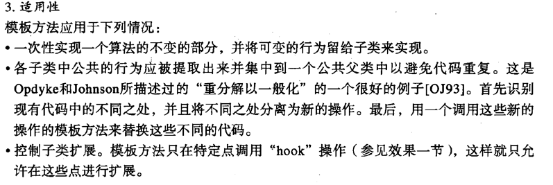
- 钩子操作就是缺省的操作，如果必须定义就用abstract来声明

## visitor 访问者模式
- 表示一个作用于某对象结构中的各元素操作。它使你可以在不改变各元素的前提下定义作用于这些元素的新操作
- 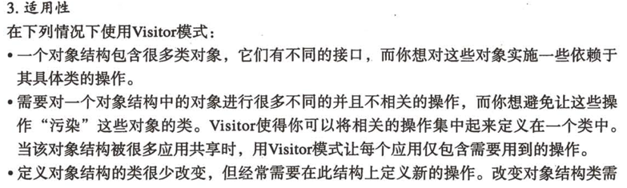
- 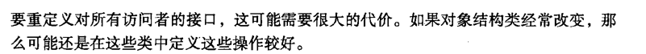

## 总结
行为模式之间往往是互相加强和兼容的关系，所以灵活的对行为模式进行嵌套使用可以大大提高开发效率。行为模式也可以和生成器模式很好的协同工作

