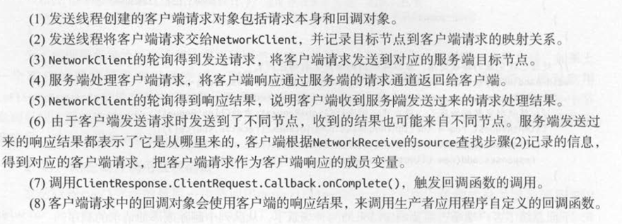
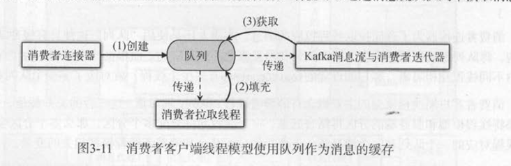

# Kafka实战笔记
## Kafka入门
- 用途：应用解耦，异步消息，流量削峰
- 三个特点：消息系统具备数据注入，存储事件流数据节点具有故障容错，数据存储。能对实时的数据流进行分析和处理，具有流处理功能
- 队列模式和发布-订阅模式，分布式存储系统，流处理系统
- kafka采取拉取模型，由消费者自己记录消费状态。。每个消费者互相独立地顺序拉取信息。
- 分区是消费者线程地最小并行单位
- kafka使用令拷贝技术提高了网络连接的速度，不被IO限制

## 生产者
- 有异步和同步两种

- 需要重新复习JAVA NIO的知识，一个接收器，和多个处理器
- 一个kafka通道只能同时发送一个信息，采用轮询的方式处理事件，整个通道由事件驱动
## 消费者
- 消费者保存消费进度，但是分区的消费进度要保存成消费组级别
- 一个分区只能属于一个消费者线程。
- 可以分为低级和高级API两种
- 
- 底层是数据块
- 